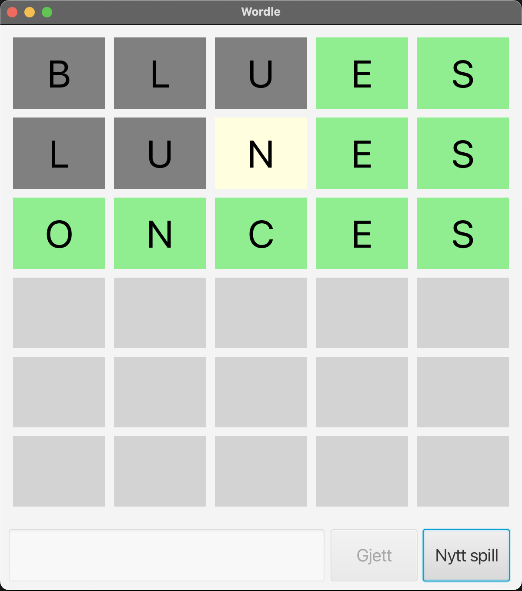
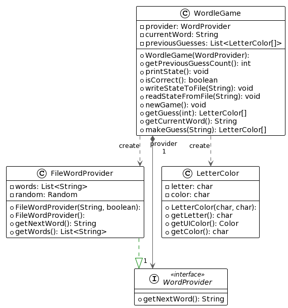

# Eksempelprosjekt for TDT4100 prosjekt V2023

Dette repoet er et eksempelprosjekt for TDT4100 prosjektet våren 2023 som skal arbeides med i øvingsforelesning.

## Beskrivelse av prosjektet

Prosjektet implementerer en versjon av det populære spillet [Wordle](https://www.nytimes.com/games/wordle/index.html). Den viktigste forskjellen mellom denne versjonen og den faktiske versjonen er at vi ikke her begrenser gjetninger til ord som finnes i ordlisten.

### Kjøring av applikasjonen

Man kan kjøre klassen via `main`-metoden i [`wordle.ui.WordleApp`](./src/main/java/wordle/ui/WordleApp.java)-klassen. Dette vil starte en JavaFX-applikasjon som viser et vindu med en Wordle.

Alternativt kan man kjøre via terminalen med
```bash
mvn javafx:run
```
Legg merke til at dette er utvidet fra eksempelprosjektet ved å legge inn [JavaFX Maven Plugin](https://openjfx.io/openjfx-docs/#maven).

### Kjapt om Wordle

Wordle er et spill hvor man skal gjette på et ord med lengde 5 bokstaver. Ordet er tilfeldig valgt fra en forhåndsdefinert liste med ord. Spilleren har 6 forsøk på å gjette riktig ord. Hver gang spilleren gjettet et ord, får han eller hun tilbakemelding på hvor mange bokstaver som er riktige, og hvor mange av disse som er på riktig plass. En bokstav som er med i ordet og er på riktig plass vil markeres med grønn farge. En bokstav som er med i ordet, men er på feil plass vil markeres med gul farge. En bokstav som ikke er med i ordet vil markeres med grå. Dersom man gjetter et ord som inneholder en bokstav flere ganger, men som kun er med i det riktige ordet en gang vil kun den første forekomsten av bokstaven bli markert.

Bilde av applikasjonen:


Man skriver inn sitt gjett i feltet nederst, trykker på "Gjett"-knappen og får tilbakemelding via rutenettet over.

### Logikk og struktur

Spill-logikken finner vi i packagen [`wordle.game`](./src/main/java/wordle/game), hvor klassen [`WordleGame`](./src/main/java/wordle/game/WordleGame.java) er den viktigste. Denne klassen er ansvarlig for å holde orden på ordene som skal gjettes, og for å sjekke om gjetninger er riktige. Spilltilstanden består av en liste med tidligere gjetninger, og et riktig ord som skal gjettes.

Vi representerer et gjett ved hjelp av et array av klassen [`LetterColor`](./src/main/java/wordle/game/LetterColor.java) som inneholder en bokstav og en farge, og korrespenderer til en enkelt rute i rutenettet vist over. Dette gjør det enkelt å sjekke om gjettet ord er riktig, og det gjør det også enkelt å vise gjettet ord i GUI-en. `LetterColor` er også såkalt immutable, det vil si at man ikke kan endre på verdiene i instansen når den er opprettet. Dette gjør at vi slepper å lage kopier av objektene når vi skal sende dem til andre klasser, som gjør det enkle å innkapsle logikken i `WordleGame`.

Ordene hentes via en implementasjon av interfacet [`WordProvider`](./src/main/java/wordle/game/WordProvider.java) som er ansvarlig for å generere ord. En implementasjon av `WordProvider` finnes i [`FileWordProvider`](./src/main/java/wordle/game/FileWordProvider.java) som leser ord fra en fil. Denne klassen er enkel å erstatte med en annen implementasjon som henter ord fra en database eller fra et API. I tillegg gjør bruken av et interface her det lett å skrive enhetstester for spilllogikken da vi kan implementere en mock-klasse som returnerer et fast sett med ord (se [`WordleGameTest`](./src/test/java/wordle/game/WordleGameTest.java) og [`FixedWordProvider`](./src/test/java/wordle/game/FixedWordProvider.java) for et eksempel).

`WordleGame` inneholder logikk som lar oss lese og skrive tilstand til og fra en fil. Ved å ha disse metodene i denne klassen kan vi unngå å åpne opp for flere metoder som kan endre på klassen utenifra. Lese-metoden er skrevet slik at den ikke endrer tilstanden før all data er lest. Dette sikrer at vi ikke kan havne i en ugyldig tilstand dersom det oppstår en feil under lesingen. Filformatet består av en linje med ordet som skal gjettes, og en linje for hvert tidligere gjett. Hver linje består av bokstaver og farger separert med komma. Eksempel på en fil:

```
ONCES
Bw,Lw,Uw,Ec,Sc
Lw,Uw,Ni,Ec,Sc
Oc,Nc,Cc,Ec,Sc
```

All kode har også java-docs som beskriver hvordan klassene og metodene fungerer, i tillegg til kommentarer i koden der det er relevant.

Se klassediagram for logikk-klassene under:



## Utvidet versjon

Det er også laget en utvidet versjon som har en historikkfunksjon, og også benytter seg av flere views ved hjelp av flere FXML-filer og controller-klasser. Denne kan finnes [her](https://gitlab.stud.idi.ntnu.no/tdt4100/v2023/prosjekt-of).