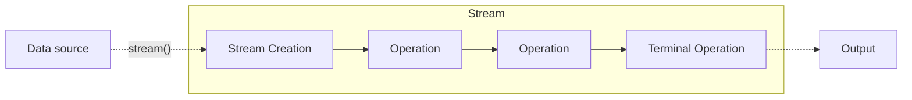

# Java stream 
Javadoc er tilgjengelig under eksamen, så en kan godt venne seg til å bruke den. Oversikt over java.util.stream finner dere her:
https://docs.oracle.com/en/java/javase/17/docs/api/java.base/java/util/stream/package-summary.html

En av prinsippene i *funksjonell programmering* er at en ikke modifiserer eksisterende data, men produserer nye data fra eksisterende. Java's stream følger dette prinsippet: 
Fra en datakilde (f.eks. en Collection), opprettes en datastrøm av dens elementer, som kan prosesseres element for element.

Prosesseringen kan bestå av flere trinn. Til slutt genreres et resultat ved en såkalt *terminal operasjon*.

## Hva kan vi gjøre med streams?
Det er to typer operasjoner. 
### Mellom-operasjoner
lager ny stream som vi kan fortsette å gjøre nye operasjoner på:
- map(Function<T,R>): bruker en funksjon til å lage ny stream fra T-objekter til R-objekter
- filter(Predicate<T>): ny støm hvor bare elementer som tilfredsstiller predikatet er med
- sorted(), sorted(Comparator<T>): ny støm hvor elementene er sortert.

Alle parametrene her er eksempler på funksjonelle grensesnitt, så en vil ofte angi disse
som *lambda-funksjoner*. 

### Terminale operasjoner
avslutter strømmen ofte med et returnert resultat:
- Collect(...) : Returnerer resultat, som f.eks. en liste, Map mm.
- forEach(Consumer<T>): Utfører en operasjon for hvert element i strømmen. **returnerer ingenting**
- reduce(): Returnerer et enkelt resultat, f.eks. sum, ...
- (flere)

I en stream, så utføres ingen prosessering skjer før en har en terminal operasjon, såkalt
"lazy evaluation". Dette betyr at kilden kan være ubegrenset, men at at senere prosesseringssteg
avslutter strømmen.

### Hva er mulige input til en stream
- Collection, arrays,...
-  Generatorer
- IO (System.in, fil, ...)

### streams endrer ikke data-kilden
Vi kan sortere elementene i strømmen med sorted, men opprinnelig kilde blir ikke sortert:
- liste.stream().sorted()->toList()

Dette i motsentning til sort() som sorterer "in place":
- liste.sort()

## Hva er en stream ikke?
- En stream ligner på en iterator, men er ikke helt det samme.
- Ikke en datastruktur, men representerer et sett operasjonene som skal utføres på elementene i kilden

