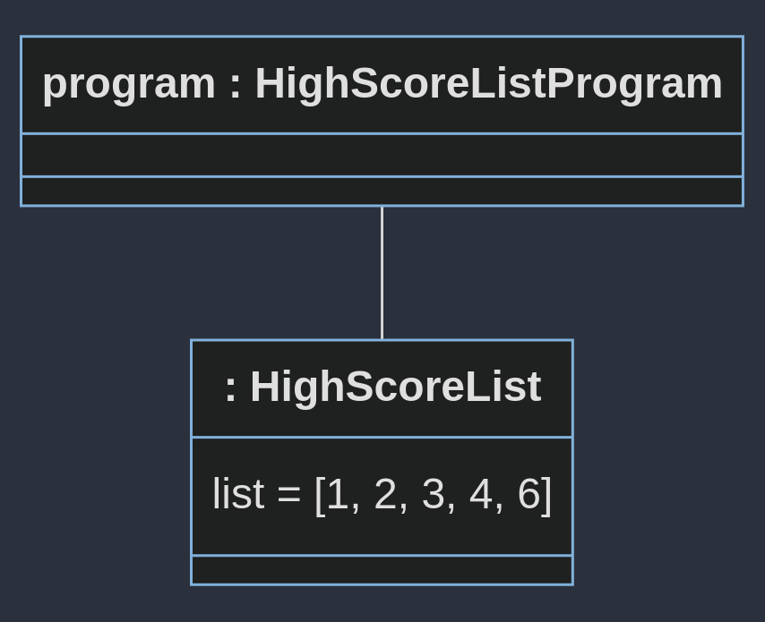
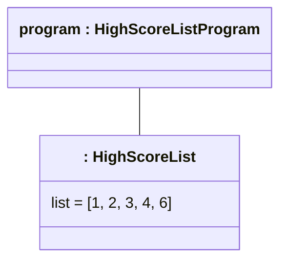

# Objektdiagram HighScore

Etter denne main-koden:
```java
	public static void main(String[] args) {
		HighscoreListProgram program = new HighscoreListProgram();
		program.init();
		program.run();
		// Brukeren skriver:
		// 1
		// 2
		// 6
		// 4
		// 3
		// 8
	}
```

Vil objektdiagrammet se sånn ut med løsningsforslaget:



Mermaid-koden (Last ned "Markodwn Preview Mermaid Support" i VSCode for å se den):

