# Objektdiagram Logger

Etter denne main-koden:
```java
	public static void main(String[] args) {
		StreamLogger s1 = new StreamLogger(System.out);
		StreamLogger s2 = new StreamLogger(System.err);
		s2.setFormatString("🚨 %s 🚨: %s (%s)");
		DistributingLogger d1 = new DistributingLogger(s2, null, s1);
		FilteringLogger f1 = new FilteringLogger(d1, ILogger.INFO, ILogger.ERROR);
	}
```

Vil objektdiagrammet se sånn ut med løsningsforslaget:


Mermaid-koden (Last ned "Markodwn Preview Mermaid Support" i VSCode for å se den):

```mermaid
classDiagram
    s1 -- d1
    s2 -- d1
    d1 -- f1
    class s1["s1 : StreamLogger"] {
        formatString = "%s: %s (%s)"
    }
    class s2["s1 : StreamLogger"] {
        formatString = "🚨 %s 🚨: %s (%s)"
    }
    class d1["d1: DistributingLogger"] {

    }
    class f1["f1: FilteringLogger"] {
        severites = ["info", "error"]
    }
```

