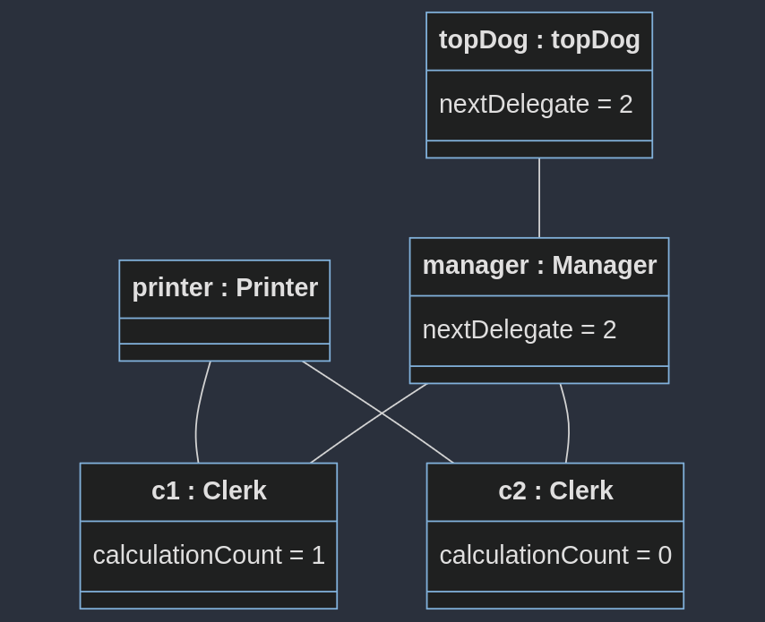
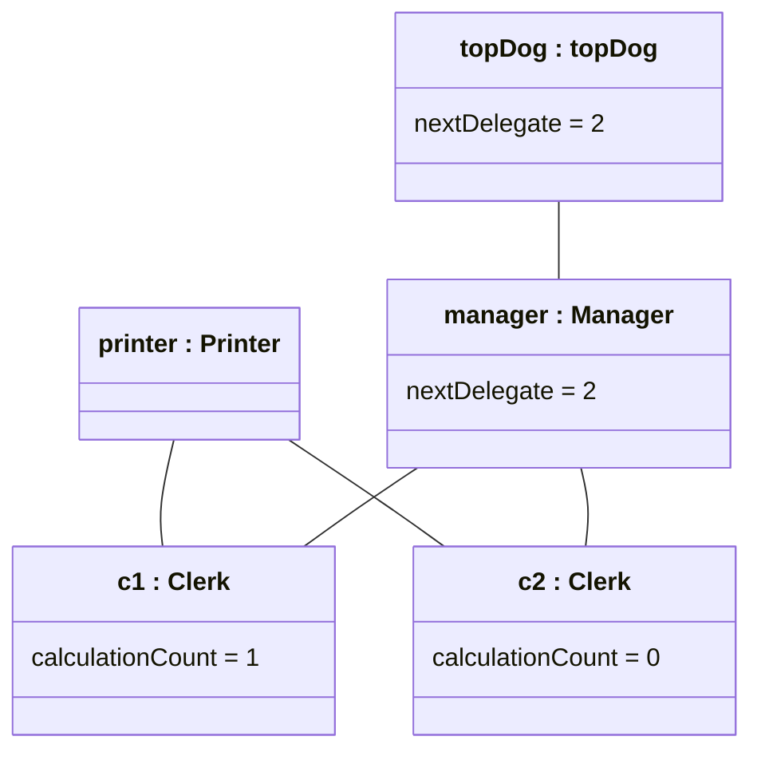

# Objektdiagram Office

Etter denne main-koden:
```java
	public static void main(String[] args) {
		Printer printer = new Printer();
		Clerk c1 = new Clerk(printer);
		Clerk c2 = new Clerk(printer);
		ArrayList<Employee> eList1 = new ArrayList<>();
		eList1.add(c1);
		eList1.add(c2);
		Manager manager = new Manager(eList1);
		ArrayList<Employee> eList2 = new ArrayList<>();
		eList2.add(manager);
		Manager topDog = new Manager(eList2);
		topDog.printDocument("Hello World");
		topDog.doCalculations((a, b) -> a + b, 1, 2);
	}
```

Vil objektdiagrammet se sånn ut med løsningsforslaget:



Mermaid-koden (Last ned "Markodwn Preview Mermaid Support" i VSCode for å se den):

