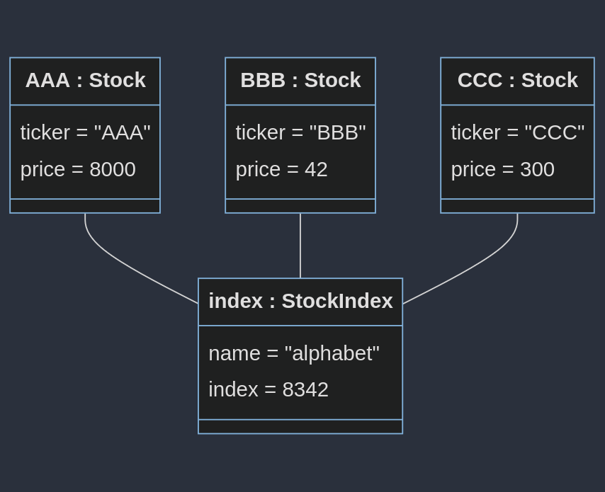
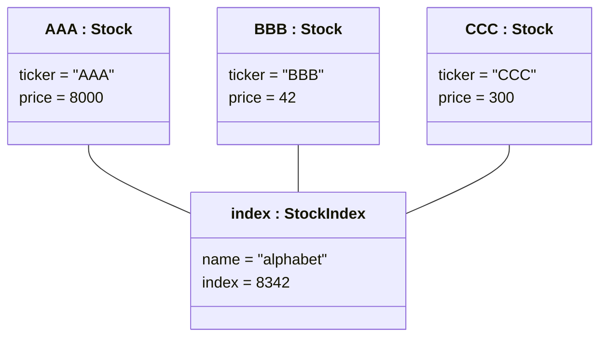

# Objektdiagram StockListener

Etter denne main-koden:
```java
	public static void main(String[] args) {
		Stock AAA = new Stock("AAA", 9001);
		Stock BBB = new Stock("BBB", 42);
		StockIndex index = new StockIndex("alphabet", AAA, BBB);
		AAA.setPrice(8000);
		Stock CCC = new Stock("CCC", 300);
		index.addStock(CCC);
	}
```

Vil objektdiagrammet se sånn ut med løsningsforslaget:



Mermaid-koden (Last ned "Markodwn Preview Mermaid Support" i VSCode for å se den):

